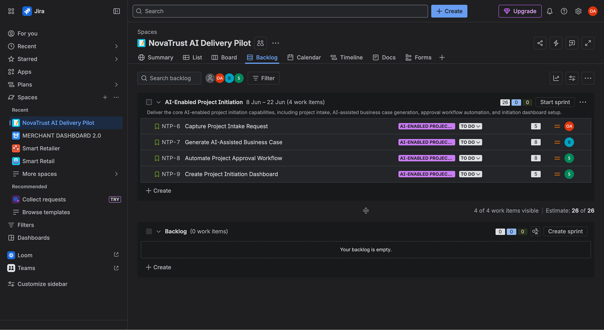
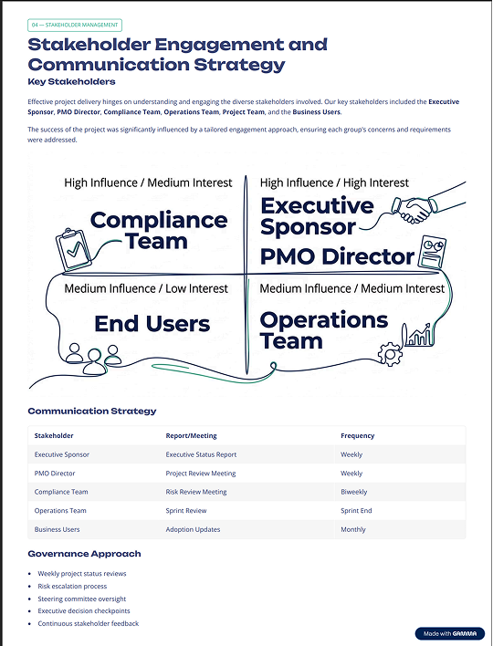
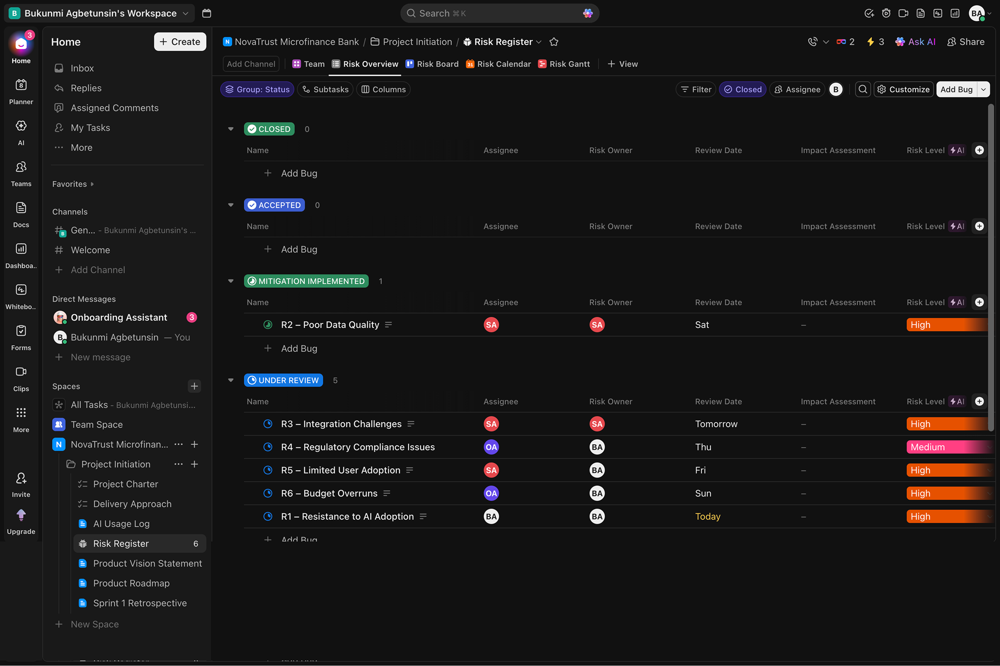

# AI-Powered Risk Reporting and Executive Reporting Automation

**Domain:** Risk Management  
**Industry:** Financial Services  
**Type:** Workflow Automation & Executive Reporting  
**Tools:** Jira, ClickUp, n8n, GPT-5, Gmail, Gamma

## Overview

This project explores how workflow automation and AI can improve executive risk reporting in a regulated financial services environment.

The solution combines ClickUp, n8n, GPT-5, Gmail, and Gamma to transform operational risk information into executive-ready reporting while maintaining governance controls and human oversight.

---

## Business Problem

Producing executive risk reports often requires gathering information from multiple project activities, reviewing updates, consolidating risk data, and manually preparing reports for leadership.

This process can be:

* Time-consuming
* Difficult to standardize
* Prone to reporting inconsistencies
* Dependent on manual effort
* Challenging to scale across multiple projects

The objective was to explore how workflow automation and AI could support a more consistent, auditable, and executive-friendly reporting process.

---

## Solution Overview

The solution was designed as an end-to-end reporting workflow that:

1. Extract project risk information from ClickUp
2. Processes and structures data through n8n
3. Generate executive summaries and recommendations using GPT-5 
4. Produce executive-ready reporting outputs
5. Distribute reports through Gmail
6. Support executive communication through Gamma presentations

The design emphasizes consistency, governance, auditability, and stakeholder visibility.

---

## Architecture

---

## Delivery Planning

The initiative was delivered using an Agile approach with structured planning, sprint reviews, and stakeholder feedback cycles.

Work was organized into delivery phases covering project initiation, risk governance, workflow automation, executive reporting, and solution validation.

Jira was used to manage backlog items, track progress, prioritize work, and maintain delivery visibility throughout the project lifecycle.

---

## Technology Stack

| Layer | Tool | Why It Was Used |
|---------|---------|---------|
| Project Management | Jira | Sprint planning and backlog management |
| Risk Management | ClickUp | Centralized risk data source |
| Automation | n8n | Workflow orchestration and reporting automation |
| AI Analysis | GPT-5 | Executive summaries and recommendations |
| Distribution | Gmail | Report delivery to stakeholders |
| Presentation | Gamma | Executive reporting presentations |

---

## Workflow Process

The workflow automates the movement of risk information from operational tracking through executive communication.

### Workflow Steps

1. Scheduled trigger initiates reporting cycle
2. Risk data is extracted from ClickUp
3. Information is validated and transformed
4. GPT-5 generates executive insights
5. Report content is assembled
6. Human review is completed
7. Approved reports are distributed through Gmail

The workflow was designed to remain repeatable, auditable, and scalable while supporting governance requirements.

---

## Executive Reporting Output

The workflow generates a structured executive report designed to support leadership visibility and decision-making.

Each report includes:

* Executive summary
* Risk assessment
* Key observations
* Recommended actions
* Reporting metadata

The output follows a consistent format to improve readability, comparability, and stakeholder communication.

---

## Stakeholder Considerations

The reporting process was designed around the information needs of executive, operational, and compliance stakeholders.

Reporting frequency, escalation requirements, approval workflows, and communication channels were considered to ensure the solution aligned with governance expectations and decision-making needs.

---

## Responsible AI Governance

AI was used to support analysis and reporting activities rather than replace human judgment.

Key governance controls included:

* Human review before distribution
* AI usage tracking
* Executive approval checkpoints
* Escalation procedures for critical risks
* Workflow auditability and traceability

These controls helped ensure transparency, accountability, and responsible use of AI-generated outputs.

---

## Risk Management

A centralized risk register was maintained to identify, assess, monitor, and mitigate project risks throughout delivery.

Risks were reviewed based on likelihood, impact, ownership, and mitigation status. Escalation thresholds were defined to ensure timely visibility of high-priority risks.

The project tracked risks related to data quality, regulatory compliance, AI adoption, system integration, user adoption, and budget management.

---

## Outcomes

The initiative demonstrated how AI-assisted automation can improve executive reporting while maintaining governance and accountability.

Benefits observed:

* Reduced manual reporting effort
* Faster executive visibility
* Consistent reporting outputs
* Improved governance and accountability
* Better stakeholder communication

The result was a repeatable reporting process that transformed risk data into structured executive insights.

---

## Lessons Learned

Key observations from the project:

* Clean and structured data is essential for meaningful AI outputs.
* Executive stakeholders value concise reporting over lengthy documentation.
* Automation improves consistency as much as efficiency.
* Governance controls are critical in AI-enabled workflows.
* Human oversight remains essential in executive decision-making processes.
